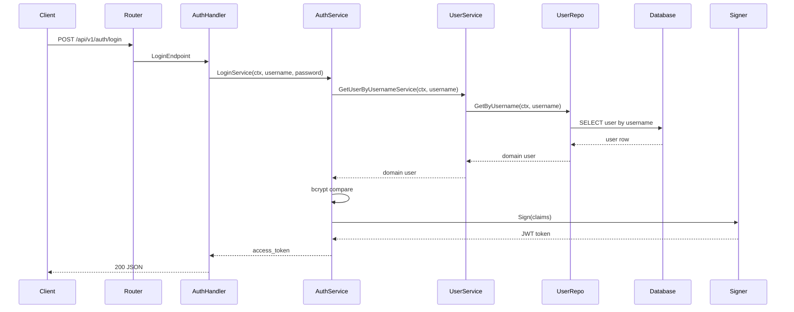
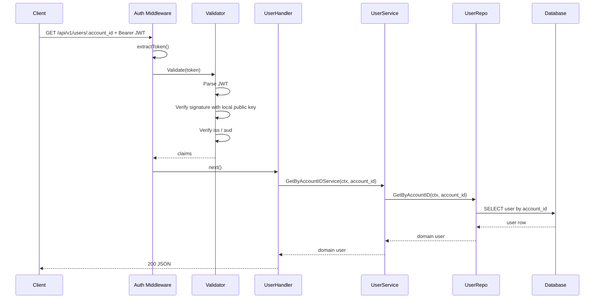
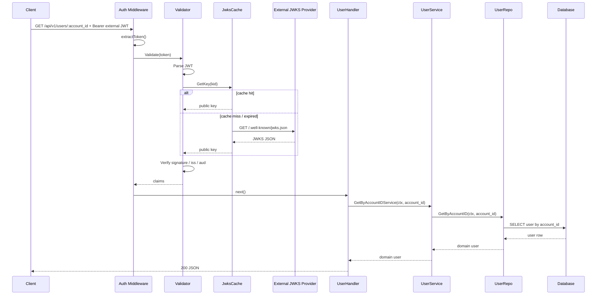

# Request Flow

เอกสารนี้อธิบาย flow ของ request ในระบบปัจจุบัน โดยอิงจากโค้ดใน `internal/adapters/http/server.go`, `internal/adapters/http/routes/routes.go`, และ middleware ที่ใช้งานจริง

## Overview

request จะไหลผ่านลำดับนี้

```text
Client
-> Fiber Server
-> Global Middleware
   -> Request ID
   -> CORS
   -> Helmet
   -> Recover
   -> Timeout
   -> Rate Limit
   -> Access Logger
-> Router (/api/{version})
-> Public Group หรือ Protected Group
-> Handler
-> Service
-> Repository
-> Database
-> Response
```

## Global Middleware

global middleware ถูกประกาศใน `internal/adapters/http/server.go`

### 1. CORS

```text
app.Use(cors.New(...))
```

หน้าที่:
- อนุญาตให้ frontend หรือ client จาก origin อื่นเรียก API ได้
- ใช้ค่า config จาก `FIBER_ALLOW_ORIGINS`, `FIBER_ALLOW_HEADERS`, `FIBER_ALLOW_METHODS`

### 2. Helmet

```text
app.Use(helmet.New())
```

หน้าที่:
- เพิ่ม security headers พื้นฐานให้ response
- ช่วยลดความเสี่ยงจาก browser-side attacks บางประเภท

### 3. Request ID

```text
app.Use(requestid.New())
```

หน้าที่:
- สร้าง `X-Request-ID` ให้ทุก request
- ใช้สำหรับ trace log และการตาม request ข้าม service

### 4. Recover

```text
app.Use(recover.New())
```

หน้าที่:
- recover panic ไม่ให้ process ล้ม
- ส่ง error กลับผ่าน Fiber error handler

### 5. Timeout

```text
app.Use(timeout.NewWithContext(...))
```

หน้าที่:
- จำกัดเวลาประมวลผลต่อ request
- ถ้า timeout จะตอบ `408 Request Timeout`

### 6. Rate Limit

```text
app.Use(limiter.New(...))
```

หน้าที่:
- จำกัดจำนวน request ต่อ IP ตาม window ที่กำหนด
- ตอนนี้ข้าม `OPTIONS`, `/health`, `/ready`

### 7. Access Logger

```text
app.Use(middleware.AccessLogger(cfg.AccessLog))
```

หน้าที่:
- log request/response ระดับ HTTP
- บันทึกข้อมูลเช่น IP, method, URL, protocol, status, bytes sent
- ไม่เกี่ยวกับ business logic

## Route Layer

route ถูกประกาศใน `internal/adapters/http/routes/routes.go`

โครงสร้างหลัก:

```text
/api
  /v1
    public routes
    protected routes
  /v2
    public routes
    protected routes
```

ระบบแยก route เป็น 2 กลุ่ม

### Public Routes

route กลุ่มนี้ไม่ผ่าน auth middleware

ตัวอย่าง:
- `GET /api/v1/health`
- `GET /api/v1/ready`
- `POST /api/v1/auth/login`
- `POST /api/v1/auth/register`

### Protected Routes

route กลุ่มนี้ผ่าน auth middleware ก่อนถึง handler

ตัวอย่าง:
- `GET /api/v1/users/:account_id`

## Auth Middleware Flow

auth middleware ถูกประกอบใน `internal/app/app.go`

```go
if cfg.Auth.Enabled {
    opts.Protected = []fiber.Handler{middleware.Auth(cfg.Auth)}
}
```

จากนั้นถูกนำไปใช้เฉพาะใน protected resources เช่น `/users`

### Flow เมื่อ request เข้า protected route

```text
Client
-> Request ID
-> CORS
-> Helmet
-> Recover
-> Timeout
-> Rate Limit
-> Access Logger
-> Protected Group
-> Auth()
   -> extractToken()
   -> ตรวจ AUTH_HEADER
   -> ตรวจ AUTH_SCHEME
   -> ตรวจ token ตาม AUTH_MODE
-> Handler
-> Service
-> Repository
-> Database
-> Response
```

### ภายใน Auth()

ไฟล์: `internal/adapters/http/middleware/auth.middleware.go`

Auth middleware ทำงานตามลำดับนี้

1. ตรวจว่า `AUTH_ENABLED` เปิดอยู่หรือไม่
2. ดึง token จาก header
3. ถ้า `AUTH_MODE=token`
   - เทียบ token กับ `AUTH_TOKEN`
4. ถ้า `AUTH_MODE=jwt`
   - ตรวจ JWT ด้วย local public key ของระบบ
5. ถ้า `AUTH_MODE=jwks` หรือ `AUTH_MODE=google`
   - เรียก `jwtValidator.Validate(token)`
6. ถ้าตรวจไม่ผ่าน
   - return `401 unauthorized`
7. ถ้าผ่าน
   - ไปต่อที่ handler

## JWT Validation Flow

ไฟล์ที่เกี่ยวข้อง:
- `internal/infra/jwt/validator.go`
- `internal/infra/jwt/jwks_cache.go`

### Flow

```text
Auth()
-> jwtValidator.Validate(token)
   -> Parse JWT
   -> ตรวจ allowed algorithms
   -> ถ้าเป็น internal JWT:
      -> ใช้ local public key
   -> ถ้าเป็น JWKS / Google:
      -> ดึง kid จาก header
      -> jwksCache.GetKey(kid)
         -> ถ้า cache หมดอายุ ให้ refresh จาก JWKS URL
         -> แปลง JWK เป็น RSA public key
   -> ตรวจ signature
   -> ตรวจ issuer
   -> ตรวจ audience
-> ผ่าน / ไม่ผ่าน
```

### หมายเหตุ

- `jwt` คือ token ที่ระบบนี้ออกเองและตรวจด้วย local public key
- `jwks` คือ external issuer ที่ตรวจผ่าน JWKS URL
- `google` คือ `jwks` แบบ preset ค่า Google
- สำหรับ template นี้ `AUTH_MODE=jwt` ใช้ `single active key`
- key ถูกโหลดเข้า memory ตอน app start เพียงครั้งเดียว
- ถ้าเปลี่ยน key file ต้อง restart app
- ถ้าเปลี่ยน key แล้ว restart, JWT เก่าที่เซ็นด้วย key เดิมอาจใช้ไม่ได้ทันที

## Mermaid Sequence Diagrams

### Internal JWT: Login Request



### Internal JWT: Protected Request



### External JWKS / Google: Protected Request



## Public Route Example

ตัวอย่าง `POST /api/v1/auth/login`

```text
Client
-> Request ID
-> CORS
-> Helmet
-> Recover
-> Timeout
-> Rate Limit
-> Access Logger
-> /api/v1 public group
-> AuthHandler.Login
-> AuthService
-> Response
-> Access Logger เขียน log
```

public route ไม่ผ่าน `Auth()`

## Protected Route Example

ตัวอย่าง `GET /api/v1/users/:account_id`

```text
Client
-> Request ID
-> CORS
-> Helmet
-> Recover
-> Timeout
-> Rate Limit
-> Access Logger
-> /api/v1 protected group
-> Auth()
-> UserHandler.GetByAccountIDHandler
-> UserService.GetByAccountIDService
-> UserRepository.GetByAccountID
-> Database
-> Response
-> Access Logger เขียน log
```

ถ้า auth ไม่ผ่าน flow จะจบที่ `Auth()` ทันที และจะไม่เข้า handler

## Responsibility Split

สรุปหน้าที่ของแต่ละ layer

- `server.go`
  - สร้าง Fiber app
  - ผูก global middleware
  - เริ่ม HTTP server

- `routes.go`
  - แยก public/protected
  - แยก version `v1`, `v2`
  - ผูก handler เข้ากับ path

- `auth.middleware.go`
  - ตรวจสิทธิ์เข้า protected routes

- `validator.go`
  - ตรวจ JWT claims และ signature

- `jwks_cache.go`
  - cache public key จาก JWKS endpoint

- `handlers`
  - รับ request และคืน response

- `service`
  - business logic

- `repository`
  - ติดต่อฐานข้อมูล

## Current Notes

- access logger ถูกใช้แบบ global ทุก request แต่เปิด/ปิดได้จาก config
- auth middleware ถูกใช้เฉพาะ protected routes
- rate limiting เปิดใช้งานได้จาก config และมี default ให้พร้อมใช้
- key rotation แบบ zero-downtime ยังไม่อยู่ใน template นี้โดยตั้งใจ เพื่อคงโครงให้เรียบและดูแลง่าย
